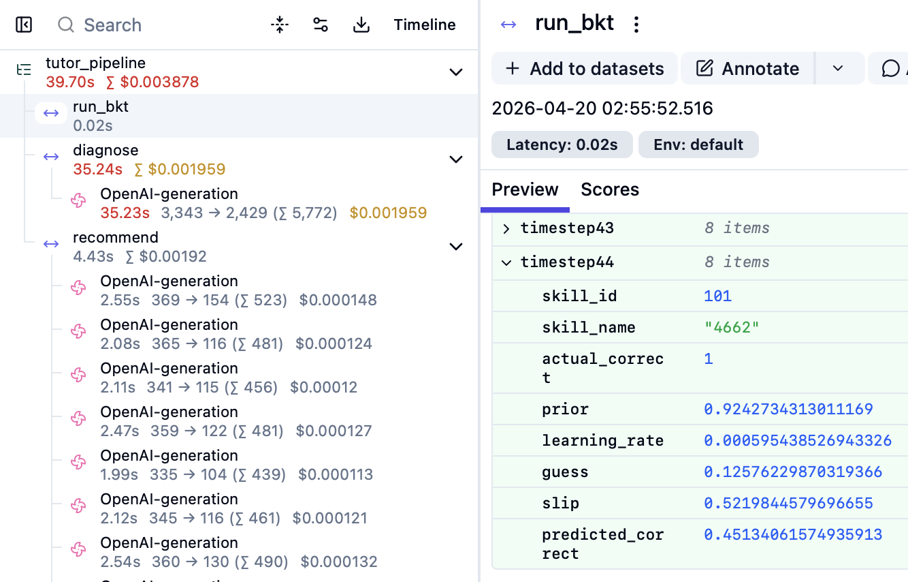
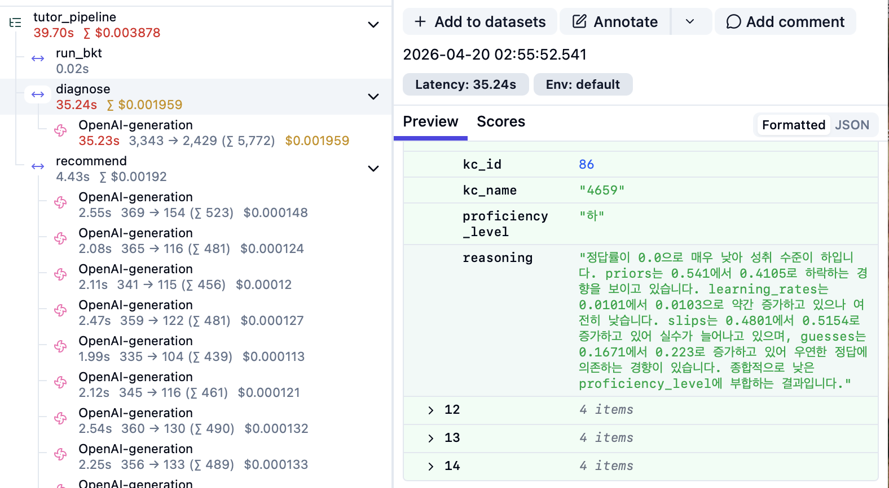

# Agentic GraphRAG Tutor

LLM 환각을 최소화하는 교사용 AI 튜터링 보조 시스템입니다.
신경망 BKT 모델(BKTransformer)로 학습 상태를 진단하고, 지식 그래프(Neo4j)를 기반으로 한 Agentic GraphRAG 파이프라인이 개인화된 학습 피드백을 생성합니다.

석사 학위 논문 기반: **TutorAgent: BKTransformer 기반 지식 추적과 Agentic GraphRAG를 통한 맞춤형 피드백 생성** — 손준호, 서울시립대학교, 2026. [[RISS]](https://www.riss.kr/search/detail/DetailView.do?p_mat_type=be54d9b8bc7cdb09&control_no=8e965dc55df10271ffe0bdc3ef48d419)

---
## 왜 만들었는가
LLM의 고질적 환각 현상은 LLM의 현장 적용을 저해하는 주 요인입니다.
교육 현장에서는 정확도만큼이나 설명 가능성(explainability)이 중요하기 때문입니다.
이 시스템은 설명 가능성을 극대화를 목표로 설계되었습니다.
또한 비용과 latency 문제를 고려하였습니다.

- **투명한 지식 상태 추출**: BKTransformer는 신경망을 이용하지만 다른 딥러닝 모델과 달리 설명할 수 없는 로짓값만을 리턴하지 않습니다. 고전적인 베이즈 정리 기반의 BKT 모델의 구조를 차용하여 BKT 파라미터(P(know), P(learn), P(guess), P(slip))를 명시적으로 출력합니다.
- **해석 가능한 진단**: 진단 에이전트는 BKT 파라미터를 근거로 사용해 학생의 숙련도(상/중/하)를 결정합니다. 모델의 추론 과정이 자연어로 설명됩니다.
- **환각 없는 개인화 추천**: 추천 에이전트는 Neo4j 지식 그래프에서 개념 간의 관계를 사전 정의된 쿼리를 통해 조회한 후 피드백을 생성합니다. LLM의 임의적, 불규칙적인 행동을 원천적으로 차단합니다.
---

## 아키텍처

```
학생 학습 이력 (skill_id, correct) x T timesteps
                        │
                        ▼
         ┌────────────────────────────┐
         │   BKTransformer (PyTorch)  │
         │       RoPE  ·  SwiGLU      │
         └──────────────┬─────────────┘
                        │
         Per-skill BKT parameters:
         P(know), P(learn), P(guess), P(slip)
                        │
                        ▼
         ┌────────────────────────────┐
         │      Diagnosis Agent       │
         │       (GPT-4o-mini)        │
         └──────────────┬─────────────┘
                        │
         Proficiency level: 상 / 중 / 하
                        │
                        ▼
         ┌────────────────────────────┐
         │    Recommendation Agent    │
         │       (GPT-4o-mini)        │
         │      Neo4j  GraphRAG       │
         │   Predefined Cypher Query  │
         └────────────────────────────┘
                        │
                        ▼
           Personalized study feedback
```

**LangGraph 흐름:** `START → run_bkt → diagnose → recommend → END`

**숙련도별 Cypher 쿼리 선택:**
| 레벨 | 쿼리 | 목적 |
|---|---|---|
| 하 (Low) | `get_prerequisites` | 먼저 학습해야 할 선행 개념 조회 |
| 중 (Mid) | `get_current_concept` | 현재 개념의 심화 학습 유도 |
| 상 (High) | `get_advanced_concepts` | 다음 단계로 도전할 수 있는 심화 개념 조회 |

---

## 기술 스택

| 레이어 | 기술 |
|---|---|
| 오케스트레이션 | LangGraph |
| 진단 모델 | PyTorch (BKTransformer) |
| LLM | OpenAI GPT-4o-mini |
| 지식 그래프 | Neo4j Aura |
| 그래프 접근 | Neo4j 비동기 드라이버 |
| 관찰 가능성 | Langfuse |

---

## 핵심 설계 결정

이 프로젝트를 진행하면서 여러 기술적 선택지를 직접 실험하고 검토했습니다. 아래에 그 판단 과정을 기록합니다.

### 1. ONNX를 사용하지 않은 이유

BKTransformer 추론 파이프라인에서 ONNX 런타임 도입을 검토했습니다.

ONNX는 텐서 연산 그래프를 최적화할 때 효과적입니다. 그러나 BKT의 핵심 연산은 텐서 행렬 계산이 아닌, 타임스텝마다 반복되는 **스칼라 단위의 베이즈 업데이트**입니다. 즉, 병렬화할 텐서 그래프 자체가 없습니다.

ONNX를 적용해도 속도 이점이 없는 반면, 직렬화 포맷 관리와 버전 호환성 문제가 발생했습니다. 따라서 PyTorch 추론을 그대로 유지했습니다.

### 2. MCP(Google GenAI Toolbox)를 사용하지 않은 이유

초기에는 Google GenAI Toolbox를 MCP 서버로 운영하고 `tools.yaml`에 Cypher 쿼리를 정의하는 방식을 사용했습니다(`langgraph_toolbox` 브랜치).

문제는 **버전 관리**였습니다. 애플리케이션 코드와 별도로 동작하는 툴박스 서버의 버전을 동기화하는 것이 개발 과정에서 지속적인 부담이 됐습니다. Cypher 쿼리를 수정할 때마다 `tools.yaml`과 코드, 서버를 모두 일치시켜야 했고, 이는 불필요한 운영 복잡도였습니다.

해결책은 단순했습니다. Cypher 쿼리를 코드 안에 직접 정의하고 Neo4j 비동기 드라이버로 직접 호출합니다. 동일한 기능을 별도 서버 없이 달성할 수 있었고, 코드베이스도 단순해졌습니다.

### 3. LlamaIndex와 LangGraph 비교

`llamaindex-experiment` 브랜치에서 LlamaIndex Workflows로 동일한 파이프라인을 구현했습니다.

**LlamaIndex의 장점**: 각 스텝이 명시적인 타입의 입력/출력 `Event`를 선언합니다. 노드 간 데이터 입출력의 검증이 쉽고, 각 노드를 독립적으로 테스트하기 쉽습니다. 또한 마이크로서비스 아키텍처가 LangGraph보다 쉽습니다.

**LangGraph를 선택한 이유**: LangGraph는 현재 AI 파이프라인 오케스트레이션의 업계 표준에 가깝습니다.

### 4. Langfuse를 선택한 이유

UI를 통해 손쉽게 워크플로우를 파악하고, 수정할 수 있습니다. 첫째, **프롬프트 버전 관리**가 간단합니다. 진단 프롬프트와 피드백 프롬프트를 Langfuse Prompt Registry에서 관리하므로, 코드 배포 없이 프롬프트를 수정하고 이전 버전과 성능을 비교할 수 있습니다. 둘째, **엔드-투-엔드 트레이싱**이 쉽습니다. BKT 출력부터 최종 피드백까지 단계별로 입출력과 시간, 비용을 볼 수 있어 워크플로우의 어느 부분을 개선해야 할지 파악할 수 있습니다. 셋째, **Human Evaluation 지원**입니다. 교육 전문가가 Langfuse UI에서 생성된 피드백의 품질을 직접 평가하고 점수를 부여할 수 있습니다.

### 5. Cypher 쿼리 결정을 에이전트에게 맡기지 않은 이유

추천 에이전트가 어떤 Cypher 쿼리를 실행할지 스스로 결정하지 않습니다. 진단 에이전트의 숙련도 레벨(상/중/하)이 쿼리를 결정합니다.

LLM이 도구 선택까지 담당하면 설명 가능성과 일관성이 떨어집니다.

이 부분은 향후 LLM 모델의 성능 향상과 함께 더 다양한 툴을 사용하도록 업데이트할 수 있습니다.

---

## 프로젝트 구조

```
src/
├── ai_tutor/
│   ├── agents/
│   │   ├── graph.py              # LangGraph StateGraph 정의
│   │   ├── state.py              # AgentState TypedDict
│   │   ├── diagnosis_node.py     # BKT 추론 + LLM 숙련도 진단
│   │   └── recommendation_node.py# GraphRAG + LLM 피드백 생성
│   ├── bkt/
│   │   └── model.py              # BKTransformer (RoPE, SwiGLU)
│   ├── tools/
│   │   └── neo4j_tool.py         # Neo4j 비동기 드라이버 + Cypher 쿼리
│   └── api.py                    # FastAPI HTTP 서비스
└── bkt_service/
    └── app.py                    # 독립 BKT 추론 서비스
```

---

## 로컬 실행 방법

1. 의존성 설치:
   ```bash
   pip install -r requirements.txt
   ```

2. `.env` 파일 생성:
   ```
   OPENAI_API_KEY=...
   LANGFUSE_HOST=...
   LANGFUSE_PUBLIC_KEY=...
   LANGFUSE_SECRET_KEY=...
   NEO4J_URI=...
   NEO4J_USERNAME=...
   NEO4J_PASSWORD=...
   BKT_CHECKPOINT=src/ai_tutor/bkt/checkpoints/<checkpoint>.pt
   N_SKILLS=138
   ```

3. Langfuse 프롬프트 등록 (최초 1회):
   ```bash
   python scripts/create_prompts.py
   ```

4. 파이프라인 실행:
   ```bash
   python -m ai_tutor.main
   ```

   또는 HTTP API 서버 시작:
   ```bash
   uvicorn ai_tutor.api:app --port 8000 --reload
   ```

---

## 배포 아키텍처 (Google Cloud Run)

```
  ┌─────────────────────────────────────────┐
  │              orchestrator               │
  │      FastAPI + LangGraph  |  512Mi      │
  └────────────────────┬────────────────────┘
                       │ POST /infer
                       │ (BKT_SERVICE_URL)
                       ▼
  ┌─────────────────────────────────────────┐
  │               bkt-service               │
  │     BKTransformer (PyTorch)  |  2Gi     │
  └─────────────────────────────────────────┘
```

두 서비스로 분리한 이유는 메모리 요구량의 차이입니다. BKTransformer는 PyTorch 모델 가중치를 메모리에 올려야 하므로 2Gi가 필요합니다. 반면 orchestrator는 LLM API 호출과 그래프 쿼리만 수행하므로 512Mi로 충분합니다. 하나의 컨테이너에 합치면 두 역할 중 하나에 불필요하게 큰 메모리를 할당해야 합니다. 분리하면 각 서비스를 독립적으로 스케일링하고 최적의 리소스만 사용할 수 있습니다.

Cloud Run을 선택한 이유는 요청이 없을 때 인스턴스가 0으로 내려가는 서버리스 특성 때문입니다. 상시 가동이 필요 없어 비용을 최소화할 수 있습니다.

---

## 관찰 가능성

모든 파이프라인 실행은 Langfuse에서 다음 계층 구조로 추적됩니다.

```
tutor_pipeline  [trace]
  ├── run_bkt      — 타임스텝별 BKT 파라미터
  ├── diagnose     — LLM 생성: 자연어 진단, 숙련도 레벨
  └── recommend    — 스킬별 LLM 생성: 그래프 컨텍스트 + 피드백
```


**[BKT 추론 결과 (run_bkt)]**
- 타임스텝별 스킬 파라미터: P(know), P(learn), P(guess), P(slip), P(correct)


**[진단 출력: 에이전트 분석]**


---

## 참고 문헌

**본 연구:**
> 손준호 (2026). TutorAgent: BKTransformer 기반 지식 추적과 Agentic GraphRAG를 통한 맞춤형 피드백 생성. 서울시립대학교 일반대학원 석사학위논문. [[RISS]](https://www.riss.kr/search/detail/DetailView.do?p_mat_type=be54d9b8bc7cdb09&control_no=8e965dc55df10271ffe0bdc3ef48d419)

**BKTransformer 원논문:**
> Badrinath, A., & Pardos, Z. (2025). Optimizing Bayesian Knowledge Tracing with Neural Network Parameter Generation. *Journal of Educational Data Mining*, 17(1), 41–65.

**RAG Survey:**
> Gao, Y., et al. (2023). Retrieval-augmented generation for large language models: A survey. *arXiv preprint arXiv:2312.10997*.

---

## 데이터셋
- **AI-Hub** — 수학분야 학습자 역량 측정 데이터, https://aihub.or.kr/aihubdata/data/view.do?currMenu=115&topMenu=100&aihubDataSe=data&dataSetSn=133
