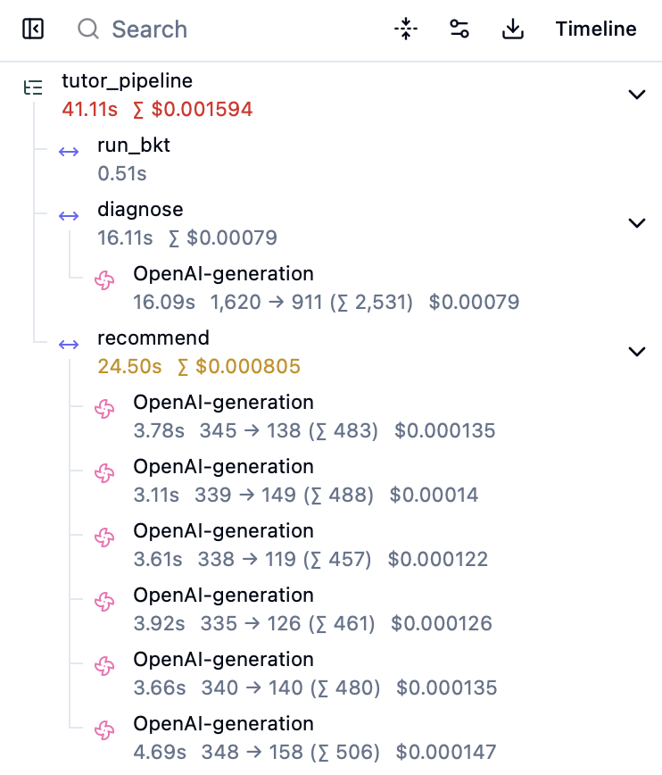
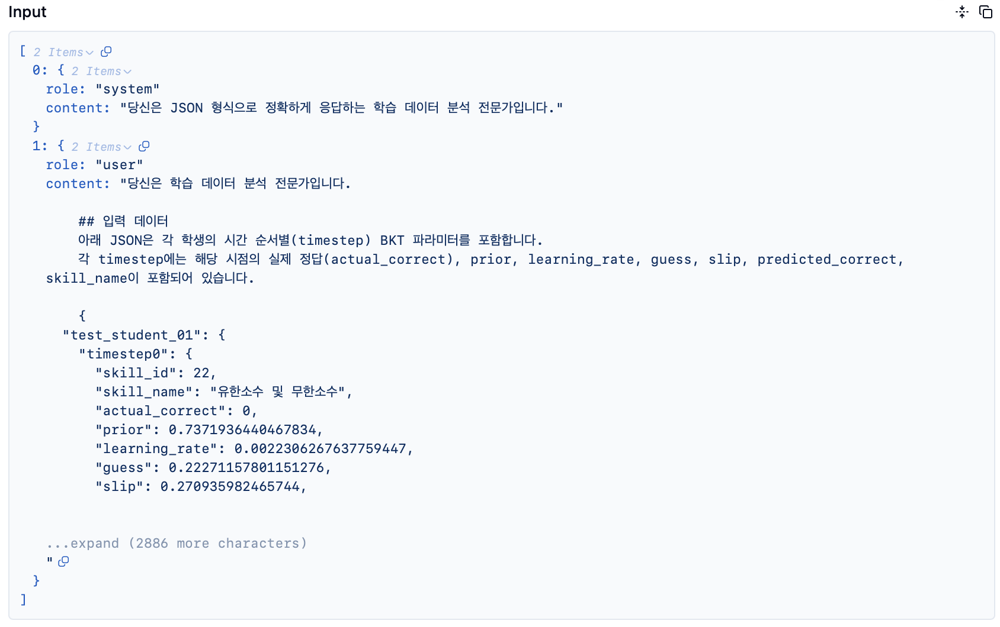
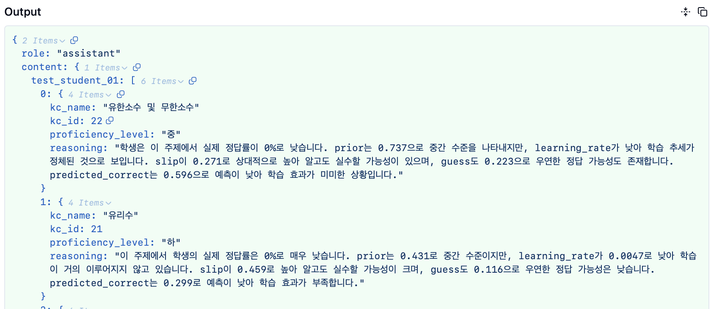
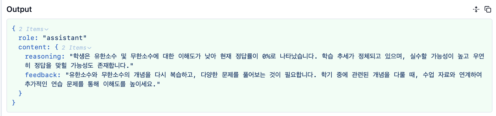

# Agentic GraphRAG Tutor

LLM 환각을 최소화하는 AI 튜터링 시스템입니다.
신경망 BKT 모델(BKTransformer)로 학습 상태를 진단하고, Neo4j 지식 그래프 기반 Agentic GraphRAG 파이프라인이 개인화된 학습 피드백을 생성합니다.

석사 학위 논문 기반: **TutorAgent: BKTransformer 기반 지식 추적과 Agentic GraphRAG를 통한 맞춤형 피드백 생성** — 손준호, 서울시립대학교, 2026. [[RISS]](https://www.riss.kr/search/detail/DetailView.do?p_mat_type=be54d9b8bc7cdb09&control_no=8e965dc55df10271ffe0bdc3ef48d419)

> **로컬 개발 브랜치** (`llamaindex-experiment`): LlamaIndex Workflows + Ollama Qwen 3 8B. 배포 파일 없음. AWS 프로덕션은 `production-readiness` 브랜치를 참조하세요.

---

## 왜 만들었는가

LLM의 고질적 환각 현상은 교육 현장 적용을 저해하는 주 요인입니다.
교육에서는 정확도만큼이나 설명 가능성(explainability)이 중요하기 때문입니다.
이 시스템은 설명 가능성 극대화와 비용·지연 시간 최소화를 목표로 설계됐습니다.

- **투명한 지식 상태 추출**: BKTransformer는 신경망을 이용하지만, 다른 딥러닝 KT 모델과 달리 설명할 수 없는 로짓값만 리턴하지 않습니다. 고전적인 베이즈 정리 기반 BKT 구조를 차용해 BKT 파라미터(P(know), P(learn), P(guess), P(slip))를 명시적으로 출력합니다. 원조 BKTransformer에 RoPE를 적용하여 파라미터를 3.2M → 2.9M으로 줄이고, AUC를 0.78 → 0.81로 향상했습니다.
- **해석 가능한 진단**: 진단 에이전트는 BKT 파라미터를 근거로 사용해 학생의 숙련도(상/중/하)를 결정합니다. 모델의 추론 과정이 자연어로 설명됩니다.
- **환각 없는 개인화 추천**: 추천 에이전트는 Neo4j 지식 그래프에서 사전 정의된 Cypher 쿼리로 개념 간 관계를 조회한 후 피드백을 생성합니다. LLM의 임의적, 불규칙적인 행동을 원천적으로 차단합니다.

---

## 아키텍처

```
학생 학습 이력 (skill_id, correct) × T timesteps
                        │
                        ▼
         ┌────────────────────────────┐
         │   BKTransformer (PyTorch)  │  ← FastAPI 프로세스 내 in-process 실행
         │       RoPE  ·  SwiGLU      │    (torch.compile 적용, 시작 시 워밍업)
         └──────────────┬─────────────┘
                        │
         Per-skill BKT parameters:
         P(know), P(learn), P(guess), P(slip)
                        │
                        ▼
         ┌────────────────────────────┐
         │      Diagnosis Agent       │
         │     (Ollama Qwen 3 8B)     │
         └──────────────┬─────────────┘
                        │
         Proficiency level: 상 / 중 / 하
                        │
                        ▼
         ┌────────────────────────────┐
         │    Recommendation Agent    │
         │     (Ollama Qwen 3 8B)     │
         │      Neo4j  GraphRAG       │
         │   Predefined Cypher Query  │
         └────────────────────────────┘
                        │
                        ▼
           Personalized study feedback
```

**LlamaIndex Workflow 흐름:**
`StartEvent → run_bkt → BKTDoneEvent → diagnose → DiagnosisDoneEvent → recommend → StopEvent`

**숙련도별 Cypher 쿼리 선택:**
| 레벨 | 쿼리 | 목적 |
|---|---|---|
| 하 (Low) | `get_prerequisites` | 먼저 학습해야 할 선행 개념 조회 |
| 중 (Mid) | `get_current_concept` | 현재 개념의 심화 학습 유도 |
| 상 (High) | `get_advanced_concepts` | 다음 단계 심화 개념 조회 |

---

## 기술 스택

| 레이어 | 기술 |
|---|---|
| 오케스트레이션 | LlamaIndex Workflows |
| 진단 모델 | PyTorch · BKTransformer (in-process, torch.compile) |
| LLM | Ollama Qwen 3 8B (Q4_K_M 양자화, 로컬) |
| 지식 그래프 | Neo4j Aura |
| 그래프 접근 | Neo4j 비동기 드라이버 |
| 관찰 가능성 | Langfuse v4 |
| API | FastAPI + uvicorn |
| 의존성 관리 | uv (uv.lock 단일 소스) |

---

## 핵심 설계 결정

이 프로젝트를 진행하면서 여러 기술적 선택지를 직접 실험하고 검토했습니다.

### 1. ONNX를 사용하지 않은 이유

BKTransformer 추론 파이프라인에서 ONNX 런타임 도입을 검토했습니다.

ONNX는 텐서 연산 그래프를 최적화할 때 효과적입니다. 트랜스포머 인코더(`_encode`)는 정적인 텐서 그래프이므로 ONNX 적용이 가능합니다. 그러나 BKT의 핵심 연산은 `_run_bkt_loop`의 **타임스텝마다 반복되는 스칼라 단위 베이즈 업데이트**입니다. ONNX는 이 반복문을 정적 그래프로 펼쳐야 하는데, `block_size=818` 기준으로 모든 BKT 연산의 복사본 818개가 그래프에 삽입됩니다. 결과적으로 수 분이 걸리는 내보내기, 수 GB의 모델 파일, 그리고 실제 추론 속도 향상 없음이라는 세 가지 문제가 동시에 발생합니다. 병목은 순차적 의존성이지 개별 연산의 연산량이 아니기 때문입니다.

### 2. torch.compile을 선택한 이유 (quantize_dynamic / TorchAO 대신)

**병목 위치**: BKTransformer의 실제 병목은 `_run_bkt_loop`입니다. 818회 반복하면서 (1, 138) 크기의 텐서에 대해 스칼라 수준의 베이즈 업데이트를 반복합니다. 반복당 CPU 커널 디스패치 오버헤드가 수십 µs씩 발생하며, 전체 루프의 지배적인 비용입니다.

**torch.quantization.quantize_dynamic을 사용하지 않은 이유**: `quantize_dynamic`은 `nn.Linear` 가중치를 float32 → int8로 압축합니다. 이는 인코더(`_encode`)의 선형 레이어 속도를 높이지만, 실제 병목인 루프에는 효과가 없습니다. 게다가 `torch.compile`의 TorchDynamo 추적과 충돌합니다. 양자화된 선형 레이어가 그래프 중단(graph break)을 유발해 컴파일된 그래프가 쪼개집니다.

**TorchAO를 사용하지 않은 이유**: TorchAO는 현대적인 `torch.compile` 친화적 양자화 라이브러리입니다. 그러나 GPU 행렬 연산(int8/int4 matmul)에서 효과가 크고, 이 모델처럼 CPU에서 실행하며 루프가 병목인 경우에는 의미 있는 속도 향상이 없습니다.

**torch.compile을 선택한 이유**: `torch.compile`의 TorchDynamo + Inductor 백엔드는 루프 자체를 최적화합니다. 반복문 내 커널 디스패치 오버헤드를 줄이고, 반복 패턴을 인식해 연산을 융합합니다. FastAPI 시작 시(`lifespan`) 더미 입력으로 한 번 실행해 컴파일을 완료해두면, 이후 실제 요청은 컴파일된 코드를 재사용합니다.

### 3. uv.lock을 단일 의존성 소스로 사용한 이유

기존 `requirements.txt`는 다른 브랜치의 의존성(`langchain-core`, `toolbox-core`)과 훈련용 라이브러리(`datasets`, `pandas`, `pyarrow`)를 포함한 `pip freeze` 스냅샷이었습니다. `langfuse` 버전이 코드와 맞지 않는 등 오류가 잦았습니다.

`uv.lock`을 단일 소스로 전환했습니다. 핵심 과제는 torch의 플랫폼 의존성 처리였습니다. Linux/CI에서 기본 PyPI torch 휠은 CUDA 라이브러리를 포함해 ~2.5 GB에 달합니다. `pyproject.toml`에 `pytorch-cpu` 인덱스를 Linux 한정으로 선언하면, macOS(로컬 개발)는 기본 PyPI에서 CPU/MPS 활성화 휠을 받고, CI(Linux)는 `pytorch-cpu` 인덱스에서 ~190 MB의 CPU 전용 휠을 받습니다. 하나의 `uv.lock`으로 두 플랫폼을 정확하게 재현합니다.

### 4. MCP(Google GenAI Toolbox)를 사용하지 않은 이유

초기에는 Google GenAI Toolbox를 MCP 서버로 운영하고 `tools.yaml`에 Cypher 쿼리를 정의했습니다 (`langgraph_toolbox` 브랜치).

문제는 **버전 관리**였습니다. 애플리케이션 코드와 별도로 동작하는 툴박스 서버의 버전을 동기화하는 것이 지속적인 부담이 됐습니다. Cypher 쿼리를 수정할 때마다 `tools.yaml`, 코드, 서버를 모두 일치시켜야 했습니다.

해결책은 단순했습니다. Cypher 쿼리를 코드 안에 직접 정의하고 Neo4j 비동기 드라이버로 호출합니다. 동일한 기능을 별도 서버 없이 달성하고 코드베이스도 단순해졌습니다.

### 5. LlamaIndex와 LangGraph 비교

동일한 파이프라인을 LangGraph(`langgraph_direct` 브랜치)와 LlamaIndex Workflows 두 가지로 구현했습니다.

**LangGraph의 작동 방식**: 파이프라인을 방향 그래프로 모델링합니다. 노드는 함수, 엣지는 연결이며, 모든 노드가 단일 가변 `AgentState` 딕셔너리를 공유합니다. 분기, 루프, 조건부 라우팅에 강점이 있습니다.

**LlamaIndex Workflows의 작동 방식**: 파이프라인을 이벤트 기반 스텝으로 모델링합니다. 각 스텝은 타입이 지정된 이벤트를 받아 타입이 지정된 이벤트를 내보냅니다. 공유 가변 딕셔너리가 없습니다.

```python
class TutorWorkflow(Workflow):
    @step
    async def run_bkt(self, ev: StartEvent) -> BKTDoneEvent: ...

    @step
    async def diagnose(self, ev: BKTDoneEvent) -> DiagnosisDoneEvent: ...

    @step
    async def recommend(self, ev: DiagnosisDoneEvent) -> StopEvent: ...
```

실행 순서는 이벤트 타입에서 자동으로 추론됩니다. 수동 `add_edge` 호출이 없습니다.

**LlamaIndex를 선택한 이유**: 파이프라인은 BKT → 진단 → 추천의 엄격히 선형적인 구조입니다. LangGraph의 강점인 조건부 라우팅이나 에이전트 루프가 불필요합니다. 결정적인 이유는 **타입 이벤트를 통한 데이터 계약**입니다. LangGraph에서는 노드가 설정되지 않은 키를 조용히 읽거나 다른 노드가 의존하는 키를 덮어쓸 수 있습니다. LlamaIndex Workflows에서는 각 스텝이 필요한 것만 포함한 타입 지정 Pydantic 이벤트를 받으므로, 누락되거나 잘못된 필드가 스텝 경계에서 즉시 오류를 발생시킵니다.

| | LangGraph | LlamaIndex Workflows |
|---|---|---|
| **최적 사용처** | 에이전트 루프, 분기, 조건부 라우팅 | 선형 결정론적 파이프라인 |
| **데이터 전달** | 공유 가변 `AgentState` 딕셔너리 | 스텝별 타입 지정 Pydantic 이벤트 |
| **스키마 강제** | 선택적 | 각 스텝 경계에서 강제 |

### 6. Langfuse를 선택한 이유

UI를 통해 워크플로우를 파악하고 수정할 수 있습니다. **프롬프트 버전 관리**: 진단·추천 프롬프트를 Langfuse Prompt Registry에서 관리하므로, 코드 배포 없이 프롬프트를 수정하고 이전 버전과 성능을 비교할 수 있습니다. **엔드-투-엔드 트레이싱**: BKT 출력부터 최종 피드백까지 단계별로 입출력, 시간, 비용을 볼 수 있어 개선이 필요한 부분을 파악할 수 있습니다. **Human Evaluation**: 교육 전문가가 Langfuse UI에서 생성된 피드백의 품질을 직접 평가할 수 있습니다.

### 7. Cypher 쿼리 결정을 에이전트에게 맡기지 않은 이유

추천 에이전트가 어떤 Cypher 쿼리를 실행할지 스스로 결정하지 않습니다. 진단 에이전트의 숙련도 레벨(상/중/하)이 쿼리를 결정합니다.

LLM이 도구 선택까지 담당하면 설명 가능성과 일관성이 떨어집니다. 사전 정의된 쿼리 선택은 GraphRAG 검색 단계에서의 투명성을 보장합니다.

---

## 프로젝트 구조

```
src/
└── ai_tutor/
    ├── bkt/
    │   ├── model.py              # BKTransformer (RoPE, SwiGLU)
    │   ├── config.py             # BKTConfig (n_skills, n_embd, block_size 등)
    │   └── checkpoints/          # 학습된 모델 가중치
    ├── workflow/
    │   ├── workflow.py           # LlamaIndex TutorWorkflow 정의
    │   ├── diagnosis.py          # BKT in-process 추론 + LLM 숙련도 진단
    │   ├── recommendation.py     # GraphRAG + LLM 피드백 생성
    │   └── schemas.py            # Pydantic 모델 (BKTTimestep, AnalysisRecord 등)
    ├── tools/
    │   └── neo4j_tool.py         # Neo4j 비동기 드라이버 + Cypher 쿼리
    ├── llm_client.py             # Ollama 클라이언트 (langfuse.openai 래퍼)
    ├── observability.py          # Langfuse 설정
    └── api.py                    # FastAPI 진입점 (BKT 워밍업 포함)

tests/                            # 단위 테스트 (순수 함수 커버리지)
scripts/                          # Langfuse 프롬프트 등록 스크립트
data/                             # 훈련 데이터셋
```

---

## 로컬 실행 방법

### 사전 요구사항

- Python 3.11+
- [uv](https://docs.astral.sh/uv/) (`pip install uv`)
- [Ollama](https://ollama.com/) 설치 및 실행

### 1. 의존성 설치

```bash
uv sync
```

### 2. Ollama 모델 다운로드

```bash
ollama pull qwen3:8b   # Q4_K_M 기본 양자화 (~5 GB)
```

Ollama 서버가 백그라운드에서 실행 중이어야 합니다 (기본값: `http://localhost:11434`).

### 3. 환경 변수 설정

```bash
cp .env.example .env
# .env에 Langfuse 키와 Neo4j 연결 정보를 입력하세요
```

`.env.example` 항목:
```
LANGFUSE_HOST=https://cloud.langfuse.com
LANGFUSE_PUBLIC_KEY=pk-lf-...
LANGFUSE_SECRET_KEY=sk-lf-...
NEO4J_URI=neo4j+s://...
NEO4J_USERNAME=neo4j
NEO4J_PASSWORD=...
LLM_BASE_URL=http://localhost:11434/v1   # Ollama 기본값
LLM_MODEL=qwen3:8b
```

### 4. Langfuse 프롬프트 등록 (최초 1회)

```bash
uv run python scripts/create_prompts.py
```

### 5. API 서버 실행

```bash
uv run uvicorn ai_tutor.api:app --port 8000 --reload
```

서버 시작 시 BKTransformer가 로드되고 `torch.compile` 워밍업이 실행됩니다 (최초 시작 시 수십 초 소요).

### 6. API 호출

```bash
curl -X POST localhost:8000/tutor \
  -H "Content-Type: application/json" \
  -d '{"student_id": "s1", "sequence": [[1,1],[2,0],[1,1]], "skill_id_to_name": {"1": "순환소수", "2": "유리수"}}'
```

---

## 관찰 가능성

모든 파이프라인 실행은 Langfuse에서 다음 계층 구조로 추적됩니다.

```
tutor_pipeline  [trace]
  ├── run_bkt      — 타임스텝별 BKT 파라미터 (P(know), P(learn), P(guess), P(slip))
  ├── diagnose     — LLM 생성: 자연어 진단, 숙련도 레벨 (상/중/하)
  └── recommend    — 스킬별 LLM 생성: 그래프 컨텍스트 + 피드백
```

**[파이프라인 트레이스]**


**[BKT 파라미터 기반 숙련도 진단 — 입력]**


**[진단 에이전트 출력]**


**[Agentic GraphRAG 개인화 피드백]**


---

## 참고 문헌

**본 연구:**
> 손준호 (2026). TutorAgent: BKTransformer 기반 지식 추적과 Agentic GraphRAG를 통한 맞춤형 피드백 생성. 서울시립대학교 일반대학원 석사학위논문. [[RISS]](https://www.riss.kr/search/detail/DetailView.do?p_mat_type=be54d9b8bc7cdb09&control_no=8e965dc55df10271ffe0bdc3ef48d419)

**BKTransformer 원논문:**
> Badrinath, A., & Pardos, Z. (2025). Optimizing Bayesian Knowledge Tracing with Neural Network Parameter Generation. *Journal of Educational Data Mining*, 17(1), 41–65.

**RAG Survey:**
> Gao, Y., et al. (2023). Retrieval-augmented generation for large language models: A survey. *arXiv preprint arXiv:2312.10997*.

---

## 데이터셋

- **AI-Hub** — 수학분야 학습자 역량 측정 데이터, https://aihub.or.kr/aihubdata/data/view.do?currMenu=115&topMenu=100&aihubDataSe=data&dataSetSn=133
